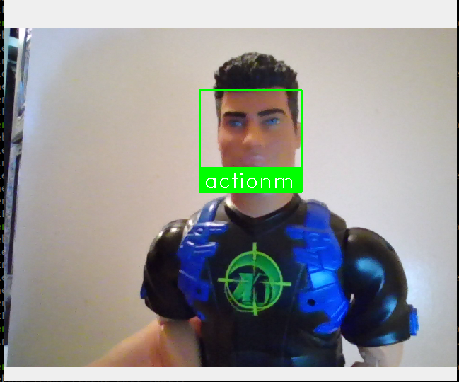
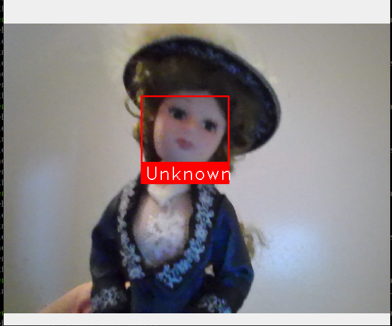
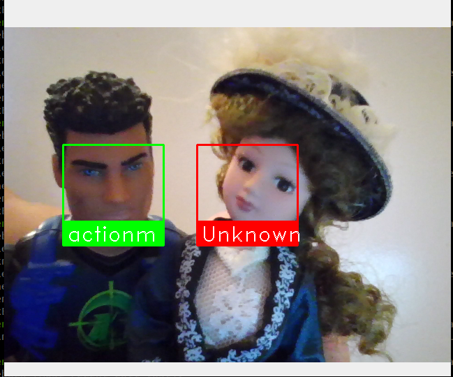

# Facial Recognition with OpenCV and face_recognition

## Overview
This Python script utilizes OpenCV and the face_recognition library to perform real-time facial recognition. The application captures video from a webcam, detects faces, and labels recognized faces within the video stream.

## Dependencies
Ensure you have the required libraries installed using the following command:

    pip install face_recognition opencv-python numpy

## Setup

Create a directory named known_faces to store images of known faces for recognition.
Populate the known_faces directory with subdirectories, each containing images of a specific person's face.

## Usage

- The **init_known_faces** function is call to update the "known_faces" directory.
- **face_reco_process** is the main function called for facial recognition. It processes the data, handles display, and returns the frame.


## Exemple
These functions can be called as shown in the following code:

**main.py :**
```python
from Reconaissance_faciale.face_reconnaissance import init_known_faces, face_reco_process
import cv2


known_faces, known_names  = init_known_faces()

# Initialize some variables
face_locations = []
face_encodings = []

video_capture = cv2.VideoCapture(0)


while True:

    image = face_reco_process(video_capture, face_locations, face_encodings, known_faces, known_names)
    # Display the resulting image with detected faces
    cv2.imshow('Video', image)

    # Hit 'q' on the keyboard to quit!
    if cv2.waitKey(1) & 0xFF == ord('q'):
        break

# Release handle to the webcam
video_capture.release()
cv2.destroyAllWindows()
    
```
### Directory structure
```txt
| App
    | main.py
    |Reconnaissance_faciale
            | face_reconnaissance.py
            |known_faces
                | your pictures...

```

## How it Works

The script initializes a list of known faces and their corresponding names from the known_faces directory.
The main function continuously captures video frames from the webcam.
Facial recognition is performed on each frame, identifying face locations and calculating 128-dimensional face encodings.
These encodings are then compared with the known faces to recognize and label faces in the video stream.
Recognized faces are displayed with bounding boxes and labeled names.


## Results 


| |||
|-----------|-----------|----------|
|known barbie| unknown barbie | together|


